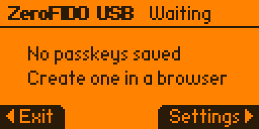
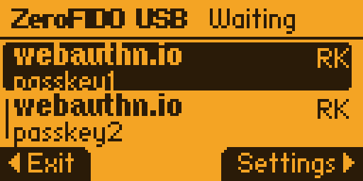
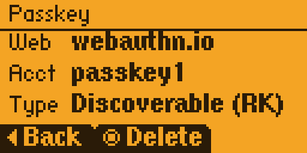
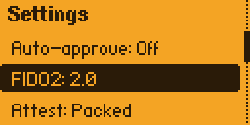
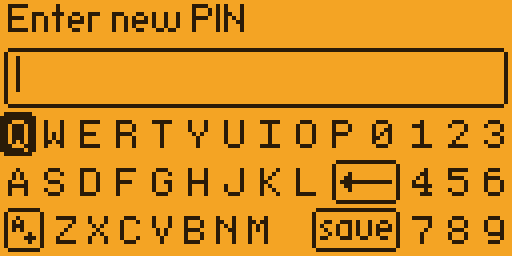
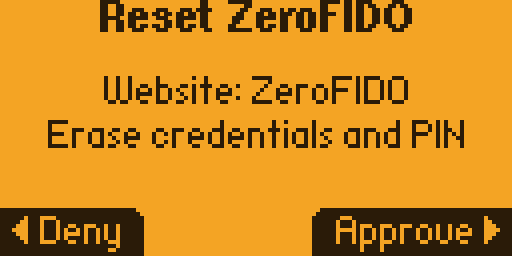

<h3 align="center">⚠️ ⚠️ Experimental software. Updates may break it. Keep backup sign-in methods. ⚠️ ⚠️</h3>

ZeroFIDO turns a Flipper Zero into a passkey and security-key app. Install the `.fap`,
open ZeroFIDO, and approve sign-ins on services that support FIDO2/WebAuthn or legacy U2F.

The app stores credentials on the Flipper, asks for local approval, supports `ClientPIN`,
and speaks the CTAP2/FIDO2 protocol used by browsers and security keys. USB HID handles
desktop browser flows. NFC builds handle phone flows.

NFC has been tested on iPhone. Android NFC support is next. In the meantime, connect the
Flipper to the phone over USB when the phone accepts USB security keys.

U2F and FIDO2.0 pass their respective tests in the current FIDO Conformance Tools suite. FIDO2.1
support is in development behind a developer-only build flag. Bug reports, feature requests, and
pull requests are welcome.

## Showcase

<table>
  <tr>
    <td></td>
    <td></td>
    <td></td>
  </tr>
  <tr>
    <td align="center">Waiting for a browser or phone request</td>
    <td align="center">Approving a new passkey</td>
    <td align="center">Saved discoverable credentials</td>
  </tr>
  <tr>
    <td></td>
    <td></td>
    <td></td>
  </tr>
  <tr>
    <td align="center">Passkey details</td>
    <td align="center">On-device settings</td>
    <td align="center">PIN management</td>
  </tr>
  <tr>
    <td></td>
    <td></td>
    <td></td>
  </tr>
  <tr>
    <td align="center">PIN entry on the Flipper</td>
    <td align="center">Reset confirmation</td>
    <td align="center">Deleting a saved passkey</td>
  </tr>
</table>

## Quick Start

1. Download a release `.fap` from [GitHub Releases](https://github.com/MinorGlitch/zerofido/releases).
2. Copy it to your Flipper SD card under the Tools apps folder, or install it through qFlipper
   or Flipper Lab.
3. Open ZeroFIDO on the Flipper.
4. Register it as a passkey or security key on a site that supports WebAuthn/FIDO2.
5. Approve registration and sign-in prompts on the Flipper screen.

## What Works

| Capability | Status |
| --- | --- |
| USB HID | Supported in the `usb` and `full` release profiles |
| NFC | Supported in the `nfc` and `full` release profiles |
| U2F V2 | Supported |
| FIDO2.0 / CTAP2.0 | Supported |
| FIDO2.1 / CTAP2.1 | Developer-only experimental build flag |
| `ClientPIN` | Supported |
| Discoverable credentials | Supported |
| Attestation | Local software attestation when requested |

ZeroFIDO builds as an external `.fap` in the Flipper Tools category.

## Daily Use

Open ZeroFIDO before starting a passkey or security-key flow.

- On desktop, connect the Flipper over USB and use the USB HID build.
- On phones, hold the Flipper near the NFC reader and use the NFC build. NFC is currently tested on
  iPhone; Android NFC support is planned. If the phone supports USB security keys, USB is the
  fallback.
- When the Flipper asks for approval, confirm only if the site and account look right.
- If a site asks for a PIN, use the browser or phone prompt. ZeroFIDO keeps the PIN retry state on
  the Flipper and uses the standard CTAP PIN token flow.

## Settings

ZeroFIDO includes an on-device Settings screen.

| Setting | Use |
| --- | --- |
| Transport | Choose USB HID or NFC when the build includes both transports. |
| Attestation | Choose how MakeCredential answers attestation requests. |
| PIN | Set, change, or manage the ClientPIN used by sites that require user verification. |
| Auto-accept | Test mode for flows that should not require a touch prompt. Only appears when built with `ZEROFIDO_AUTO_ACCEPT_REQUESTS=1`. |

## Security Model and Limits

- ZeroFIDO runs on general-purpose Flipper Zero hardware. There is no secure element, so physical
  access to the device changes the risk model.
- Credential private keys are generated on the device and stored only after being wrapped with the
  Flipper crypto enclave unique key and a per-record IV. App storage still contains the metadata
  needed to find and use credentials, including relying-party IDs, user fields, public keys, wrapped
  private keys, IVs, and counters.
- Counter floor files and PIN retry state are sealed with the same Flipper crypto APIs. ZeroFIDO
  protects key material and rollback-sensitive state; it does not encrypt the whole app directory.
- Attestation is local software attestation, not hardware-backed vendor provenance, and ZeroFIDO is
  not FIDO Alliance certified.
- Keep at least one backup sign-in method for accounts you care about.

## Attestation

<details>
<summary>Choosing <code>Attest: none</code> or <code>Attest: packed</code></summary>

ZeroFIDO defaults to `Attest: none` and supports two MakeCredential attestation modes from the
on-device Settings screen:

- `Attest: none` returns `fmt: "none"` with an empty attestation statement. The credential is still
  created normally, but ZeroFIDO does not include the local attestation certificate chain or
  attestation signature.
- `Attest: packed` allows local software packed attestation when the relying party requests direct
  attestation. This identifies the ZeroFIDO install, not hardware-backed vendor provenance.

If the CTAP request includes `attestationFormats` and names a supported format, that explicit
preference wins over the saved setting. ZeroFIDO currently supports `none` and `packed`.

</details>

## For Developers

<details>
<summary>Developer setup, builds, validation, releases, and certification metadata</summary>

### Setup

Install `uv`, then sync the Python tools:

```bash
uv sync
```

The Python toolchain declares Python `3.14+` in `pyproject.toml`. C validation expects
`clang-format`, `clang-tidy`, `cppcheck`, and a host C compiler.

On macOS:

```bash
brew install llvm cppcheck
```

### Build Profiles

The app manifest reads `ZEROFIDO_PROFILE` at build time. The default profile is `usb`, with
the stable FIDO2.0 profile enabled by default. Release builds default to
`ZEROFIDO_RELEASE_DIAGNOSTICS=0`.

| Profile | Build flag | Use |
| --- | --- | --- |
| USB HID only | `ZEROFIDO_PROFILE=usb` | Default; desktop browser WebAuthn and U2F testing. |
| NFC only | `ZEROFIDO_PROFILE=nfc` | Phone and NFC conformance work. |
| Full | `ZEROFIDO_PROFILE=full` | Both transports in one app. |

Release-default builds exclude the NFC trace implementation. Diagnostics must opt in:

```bash
ZEROFIDO_PROFILE=nfc ZEROFIDO_RELEASE_DIAGNOSTICS=1 uv run python -m ufbt
```

Build a profile:

```bash
ZEROFIDO_PROFILE=nfc uv run python -m ufbt
ZEROFIDO_PROFILE=usb uv run python -m ufbt
ZEROFIDO_PROFILE=full uv run python -m ufbt
```

Build and launch on a connected Flipper:

```bash
ZEROFIDO_PROFILE=usb uv run python -m ufbt launch
```

The normal build output is `dist/zerofido.fap`.

### Validation

Run the maintained Python tests:

```bash
uv run python -m unittest discover -s tests -t . -p 'test_*.py'
```

Run native protocol regressions:

```bash
uv run python tools/run_protocol_regressions.py
```

The native harness checks packed attestation, runtime `Attest: none`, explicit
`attestationFormats: ["none"]`, and required packed-attestation failures.

Run C formatting and analyzers:

```bash
uv run python tools/check_c.py format
uv run python tools/check_c.py format --fix
uv run python tools/check_c.py tidy
uv run python tools/check_c.py cppcheck
uv run python tools/check_c.py native
uv run python tools/check_c.py all
```

Check SDK symbols against a local Flipper firmware checkout:

```bash
uv run python host_tools/check_symbol_gate.py --sdk-root <flipper-firmware-checkout>
```

Check and package a built `.fap` with the release export gate:

```bash
uv run python host_tools/check_symbol_gate.py \
  --fap dist/zerofido.fap \
  --output-fap dist/zerofido-release.fap
```

### Host Tools

List and probe FIDO HID devices:

```bash
uv run python host_tools/ctaphid_probe.py --cmd list
uv run python host_tools/ctaphid_probe.py --cmd init
uv run python host_tools/ctaphid_probe.py --cmd getinfo
uv run python host_tools/ctaphid_probe.py --cmd makecredential
uv run python host_tools/ctaphid_probe.py --cmd getassertion
```

Run U2F transport probes:

```bash
uv run python host_tools/ctaphid_probe.py --cmd u2fversion
uv run python host_tools/ctaphid_probe.py --cmd u2fregister --u2f-cert-out metadata/u2f-attestation.der
uv run python host_tools/ctaphid_probe.py --cmd u2finvalidcla
uv run python host_tools/ctaphid_probe.py --cmd u2fversiondata
uv run python host_tools/ctaphid_probe.py --cmd u2fauthinvalid
```

Capture a FIDO2 attestation leaf certificate from `MakeCredential`:

```bash
uv run python host_tools/ctaphid_probe.py \
  --cmd makecredential \
  --fido2-cert-out metadata/fido2-attestation.der
```

Capture NFC trace lines from the Flipper USB CDC console:

```bash
uv run python host_tools/nfc_trace_console.py --port auto
uv run python host_tools/nfc_trace_console.py --port <serial-port> --level info --output .tmp/nfc-trace.log
```

The iPhone NFC transport notes are in [docs/writeup_ios.md](docs/writeup_ios.md).

Capture reconnecting crash logs from the same CDC console:

```bash
uv run python tools/flipper_crash_log.py --port auto --output .tmp/flipper-crash.log
```

Print firmware footprint data after building:

```bash
uv run python host_tools/size_ledger.py --artifact dist/zerofido.fap --artifact dist/zerofido-release.fap
```

### Release Packaging

Build a release `.fap` for the selected profile and verify that the app exports only
`zerofido_main`:

```bash
ZEROFIDO_PROFILE=usb \
ZEROFIDO_RELEASE_DIAGNOSTICS=0 \
uv run python host_tools/package_release.py
```

Package an existing `dist/zerofido.fap` without rebuilding:

```bash
uv run python host_tools/package_release.py \
  --skip-build \
  --fap dist/zerofido.fap \
  --output-fap dist/zerofido-release.fap
```

The packaged artifact lands at `dist/zerofido-release.fap` by default.

### GitHub Releases

The `Build profiles` workflow verifies every push and pull request. The `Release` workflow
publishes GitHub Releases from existing `v*` tags.

Create and push a tag:

```bash
git tag v0.7.0
git push origin v0.7.0
```

The release workflow builds the `nfc`, `usb`, and `full` profiles with
`ZEROFIDO_RELEASE_DIAGNOSTICS=0`, packages the stripped `*-release.fap` artifacts, and uploads
`SHA256SUMS`.

You can also run the workflow from GitHub Actions with an existing tag such as `v0.7.0`.

### Certification Metadata

Metadata and captured attestation certificates belong to your local certification run. Keep them
under `metadata/`; git ignores that directory. The exporter creates `metadata/` and a default
`metadata/statement.json` when they are missing.

```bash
uv run python host_tools/export_certification_metadata.py \
  --statement metadata/statement.json \
  --profile fido2-2.0 \
  --client-pin-state unset

uv run python host_tools/export_certification_metadata.py \
  --statement metadata/statement.json \
  --profile fido2-2.1-experimental \
  --client-pin-state unset
```

The `fido2-2.1-experimental` metadata profile is for development builds created with
`ZEROFIDO_DEV_FIDO2_1=1`; release builds ship the FIDO2.0 profile.

The default outputs are:

- `metadata/metadata-ctap20.json`
- `metadata/metadata-ctap21-experimental.json`

For FIDO2 packed attestation chain checks, export metadata with the certificate returned by
the same device:

```bash
uv run python host_tools/ctaphid_probe.py \
  --cmd makecredential \
  --fido2-cert-out metadata/fido2-attestation.der

uv run python host_tools/export_certification_metadata.py \
  --statement metadata/statement.json \
  --profile fido2-2.0 \
  --fido2-attestation-cert metadata/fido2-attestation.der
```

For U2F, export metadata from the certificate returned by U2F Register:

```bash
uv run python host_tools/ctaphid_probe.py \
  --cmd u2fregister \
  --u2f-cert-out metadata/u2f-attestation.der

uv run python host_tools/export_certification_metadata.py \
  --statement metadata/statement.json \
  --profile u2f \
  --u2f-attestation-cert metadata/u2f-attestation.der
```

If U2F metadata reports an attestation SKID or certificate-path mismatch, regenerate
`metadata/u2f-attestation.der` and `metadata/metadata-u2f.json` from the same device build you are
testing. Older builds regenerated U2F attestation during reset, so metadata captured before a reset
can be stale.

If the conformance tool changes PIN state, regenerate metadata with the matching
`--client-pin-state` before rerunning that profile.

</details>

## Support

ZeroFIDO is built and maintained in spare time. If it helped you, you can support the work here:

[](https://buymeacoffee.com/astoyanov)

Support is optional and does not affect releases, issues, or support requests.

## License

ZeroFIDO uses the GNU General Public License, version 3 or later. See [`LICENSE`](LICENSE).

Dependency and provenance notes live in [`THIRD_PARTY_NOTICES.md`](THIRD_PARTY_NOTICES.md).
